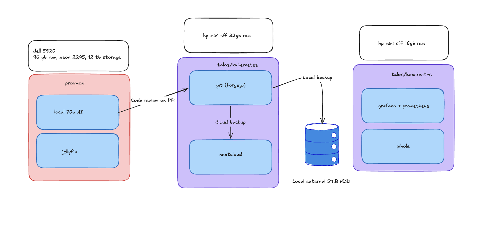

# Personal Homelab

This repo reflects the state of my own personal homelab. 

## The homelab consists of three machines:

1. Dell 5820 Workstation: Xeon 2245, 96GB RAM and a 8GB RTX 4000.

2. HP Mini SFF 1, Intel i7, 32GB RAM.

3. HP Mini SFF 2: Intel i7, 16GB RAM. 

# Architecture and Stack

## Documentation

The documentation for each machine will be split into three parts:

1. Explanation

A brief explanation of what I need the machine for, and how it serves me a purpose. It was quite important for me from the start, that I did not just build services upon services, just for the sake of it. I need to have a usecase for each one, something that actually makes my life easier, or improves upon it.

2. Setup

How I will get from bare metal to a running service.

3. Deadline.

Although I don't have any real deadlines, it's important for me to keep a consistent focus and more so because in real work life, there is always a deadline.

---

[Dell documentation](/docs/dell.md)

[HP SFF 1 documentation](/docs/hp_sff_1.md)

[HP SFF 2 documentation](/docs/hp_sff_2.md)
